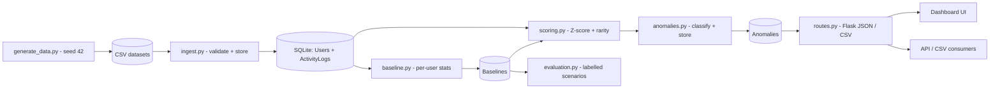
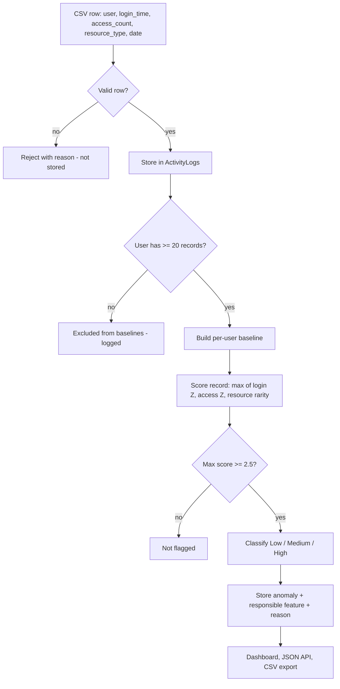

# Explainable Behaviour-Based Insider Threat Detection System


-6E40AA)


Detects anomalous insider behaviour from structured activity data using **per-user
statistical baselines**, **Z-score deviation scoring**, a **calibrated categorical
rarity** measure, configurable **severity bands**, and an **explainable** web
dashboard. It runs on **synthetic data only** and makes no machine-learning,
network, or cloud assumptions.

> **What this is.** A reproducible academic software artefact (COM668 Computing
> Project, AT3). Every number on screen is traceable to a transparent statistic, a
> fixed random seed, and a one-command rebuild. The detector explains *why* each
> record was flagged rather than emitting an opaque score.

---

## Problem

Security teams need to spot insiders behaving unlike themselves -- logging in at
unusual hours, touching far more resources than normal, or reaching for data they
never normally use. Two things make this hard in practice:

1. **There is no shared "normal".** A 60-access day is routine for an engineer and
   alarming for an HR user. A single global threshold is wrong for almost everyone.
2. **Black-box scores are not actionable.** An analyst cannot triage "user U019:
   risk 0.87". They need the *responsible feature* and a human-readable reason.

This system answers both: it learns a **separate baseline per user**, scores each
new record against *that user's* history, and stores the single responsible feature
plus a plain-English reason alongside every anomaly.

## What It Does

| Capability | Summary | Implemented by |
|---|---|---|
| Deterministic data | Reproducible synthetic history + labelled scenarios from seed 42 | `data/generate_data.py` |
| Validated ingestion | Per-row validation with explicit rejection reasons, parameterised SQL | `app/ingest.py` |
| Relational store | Four-table SQLite schema with foreign keys enabled per connection | `data/schema.sql`, `app/db.py` |
| Per-user baselines | Mean/SD of login hour and access count, plus resource distribution | `app/baseline.py` |
| Deviation scoring | Absolute Z-score for numeric features, calibrated rarity for categorical | `app/scoring.py` |
| Severity + storage | Mutually exclusive Low/Medium/High bands, persisted with a reason | `app/anomalies.py` |
| Explainability | Responsible feature and reason stored on every anomaly | `Anomalies.anomaly_reason` |
| Dashboard + API | Summary tiles, user/date/severity filters, row-click detail, JSON API | `app/routes.py`, `app/templates/` |
| CSV export | Download the currently filtered anomaly view (FR10) | `GET /api/anomalies.csv` |
| Labelled evaluation | Per-scenario + combined precision/recall/F1/FPR + threshold sweep | `app/evaluation.py` |
| Tests + CI | 115-test pytest suite and a GitHub Actions workflow | `tests/`, `.github/workflows/ci.yml` |

## System Architecture

Three layers: a deterministic **data layer**, a pure **detection core**, and a
read-only **presentation layer**. Data flows one way; the detection core performs no
I/O of its own and is fully unit-testable in isolation.



| Layer | Modules | Responsibility |
|---|---|---|
| Data | `data/generate_data.py`, `app/ingest.py`, `app/db.py`, `data/schema.sql` | Generate, validate, and persist activity into a relational store |
| Detection core | `app/baseline.py`, `app/scoring.py`, `app/anomalies.py` | Build baselines, score deviation, classify and store anomalies |
| Presentation | `app/routes.py`, `app/templates/`, `app/static/` | Serve the dashboard and read-only JSON/CSV endpoints |
| Evaluation | `app/evaluation.py` | Score labelled scenarios against baselines and report metrics |
| Orchestration | `scripts/rebuild.py`, `run.py` | One-command rebuild and the development server |

## End-To-End Workflow



## Detection Model

This is the artefact's "trust model" -- a precise statement of what a flag does and
does not mean, so results are never over-claimed.

**The detector flags a record when its behaviour deviates from that same user's own
historical baseline by at least the configured threshold.** It is a transparent,
per-user statistical outlier detector -- not a classifier of intent.

| It detects | It does **not** detect |
|---|---|
| A user logging in far outside their own usual hours | Whether the activity was actually malicious |
| A user accessing many more resources than they normally do | Coordinated low-and-slow behaviour spread thinly across features |
| A user touching a resource type that is rare or unseen for them | Threats that look statistically identical to the user's baseline |
| Per-user deviation, calibrated to each user's variability | Cross-user collusion or absolute (non-relative) policy violations |

Key honesty points, expanded in [docs/MODEL_ASSUMPTIONS.md](docs/MODEL_ASSUMPTIONS.md):

- A flag means **statistical deviation**, not confirmed intent. Labels in the
  evaluation come from the scenario generator, not analyst-confirmed incidents.
- Scoring uses the **single strongest feature**, so several weak signals together can
  be missed (this is exactly why five exfiltration cases are missed -- see Evaluation).
- The dashboard's stored anomalies are outliers found within the same history used to
  build the baselines; the **labelled scenarios** provide the stronger held-out test.

## Detection Rules

Three features are scored on a common scale so a single threshold applies to all of
them. The maximum of the three is the record's deviation score.

| Feature | Method | Notes |
|---|---|---|
| `login_time` | Absolute Z-score `|(value - mean) / sd|` of login hour | Time is treated linearly (a known limitation near midnight) |
| `access_count` | Absolute Z-score of daily access count | Per-user mean/SD from the baseline |
| `resource_type` | Calibrated surprisal `max(0, -log(p) + log(0.05))` | 0 for resources >= 5% frequency; ~3.9 for unseen |

Severity bands (configurable in `app/config.py`, mutually exclusive):

| Band | Condition (default) |
|---|---|
| (not flagged) | score < 2.5 |
| **Low** | 2.5 <= score < 3.0 |
| **Medium** | 3.0 <= score < 4.0 |
| **High** | score >= 4.0 |

A zero-standard-deviation baseline that is then violated returns a finite sentinel
score (`999.0`) so it flags as High without producing `inf`/`NaN`. See
[docs/DETECTION_ENGINE.md](docs/DETECTION_ENGINE.md) for the full semantics.

## Dashboard

The root route serves a single-page dashboard that loads its data client-side from
the JSON API. It provides:

- **Summary tiles** -- total activity logs, total anomalies, high-risk count, users
  monitored.
- **Filter panel** -- by user, date range, and severity, all applied through
  parameterised SQL.
- **Anomaly table** -- sorted by deviation score, with a **Download CSV** button that
  exports exactly the current filtered view.
- **Row detail** -- click a row to see the responsible feature, score, and reason.

## Quick Start

```powershell
# 1. Environment (Windows PowerShell)
python -m venv .venv
.\.venv\Scripts\Activate.ps1
pip install -r requirements.txt

# 2. Build the deterministic demo database, then start the app
python scripts/rebuild.py
python run.py
```

Open `http://127.0.0.1:5000/` for the dashboard. (If port 5000 is in use on your
machine, run with Flask's CLI and `--port`, e.g.
`python -m flask --app run:app run --host 127.0.0.1 --port 5050`.)

A clean rebuild is deterministic and produces:

```
ingested 12092 rows, 20 users, 0 rejected
20 baselines built, 0 users excluded
299 anomalies stored (Low 256 / Medium 41 / High 2)
```

## CLI Reference

| Command | Purpose |
|---|---|
| `python scripts/rebuild.py` | Full deterministic rebuild: reset DB, regenerate, ingest, baseline, score (recommended) |
| `python scripts/rebuild.py --no-reset` | Append to the existing DB instead of resetting (advanced) |
| `python run.py` | Start the development server on `127.0.0.1:5000` |
| `python -m app.evaluation` | Run labelled-scenario evaluation; print metrics and write evidence files |
| `python data/generate_data.py` | Regenerate the synthetic CSV datasets only |
| `python -m app.ingest` | Ingest `data/activity_baseline.csv` and print a summary |
| `python -m app.baseline` | Build per-user baselines into `Baselines` |
| `python -m app.anomalies` | Score activity and store flagged anomalies (clears first) |
| `pytest` | Run the full test suite |

`rebuild.py` exists because ingestion is intentionally **not** idempotent -- the
individual steps must be run against a fresh database. Full route specifications are
in [docs/API_ENDPOINTS.md](docs/API_ENDPOINTS.md).

## API Summary

| Method & path | Description |
|---|---|
| `GET /` | Dashboard UI (loads data from the JSON API client-side) |
| `GET /health` | Liveness check; returns `{"status": "ok"}` |
| `GET /api/summary` | Totals: activity logs, anomalies, high-risk count, users monitored |
| `GET /api/anomalies` | Flagged anomalies as JSON; optional `user`, `start`, `end`, `severity` filters |
| `GET /api/anomalies.csv` | The same filtered anomalies as a downloadable CSV (FR10) |

Example: `GET /api/anomalies?severity=High&start=2025-05-01`. All filters are bound as
SQL parameters, so unknown values return an empty result, never an error.

## Data & Schema

Synthetic data is generated by a single seeded NumPy generator (`SEED = 42`) across 20
users and four role profiles, producing a 100-day baseline history plus three labelled
scenarios (`normal`, `after_hours`, `exfiltration`). The relational schema has four
tables:

| Table | Holds |
|---|---|
| `Users` | One row per monitored user (`user_id`, name, role) |
| `ActivityLogs` | Ingested activity events (login time, access count, resource type, date) |
| `Baselines` | Per-user statistics and the resource distribution JSON |
| `Anomalies` | Flagged records with deviation score, severity, reason, detection timestamp |

See `data/schema.sql` and `data/data_dictionary.md` for column-level detail.

## Project Structure

```
app/          Flask factory, config, db layer, ingest, baseline, scoring, anomalies, routes, evaluation
  templates/  Dashboard HTML shell
  static/     Dashboard JS/CSS
data/         schema.sql, deterministic generator, data dictionary, generated CSVs
scripts/      rebuild.py - one-command deterministic database rebuild
tests/        pytest suite (behavioural, integration, security, evaluation)
docs/         Reference docs (architecture, detection engine, model assumptions, API, config, testing) + evaluation report
evidence/     Generated metrics, exports, terminal output (for AT4)
screenshots/  Demonstration captures
instance/     SQLite database (generated at runtime; not committed)
run.py        Development server entry point
```

## Configuration

All tunable parameters live in `app/config.py` (thresholds, minimum baseline records,
database path). Defaults: `Z_LOW = 2.5`, `Z_MEDIUM = 3.0`, `Z_HIGH = 4.0`,
`MIN_RECORDS = 20`. The test suite uses a separate database via `TestingConfig`. See
[docs/CONFIGURATION.md](docs/CONFIGURATION.md).

## Testing & Evaluation

```powershell
pytest                     # 115 tests: behavioural, integration, security, evaluation
python -m app.evaluation   # labelled metrics; writes evidence/metrics.json + evaluation_output.txt
```

On the bundled labelled scenarios (210 records, 56 labelled anomalies) the detector
achieves, at the default threshold (2.5):

| Metric | Value |
|---|---|
| Precision | 0.9444 |
| Recall | 0.9107 |
| F1 | 0.9273 |
| False-positive rate | 0.0195 |

These figures describe the **synthetic** scenarios only. Per-scenario breakdowns,
threshold trade-offs, and an honest discussion of the missed exfiltration cases are in
[docs/evaluation-report.md](docs/evaluation-report.md) and
[docs/TESTING_SUMMARY.md](docs/TESTING_SUMMARY.md).

## Continuous Integration

`.github/workflows/ci.yml` runs on pushes and pull requests using Python 3.11. It
installs `requirements.txt`, runs `python scripts/rebuild.py`, then `pytest -q`, then
`python -m app.evaluation`, so the entire reproducible workflow is exercised on every
change.

## AT2 Traceability

| AT2 reference | Implemented by |
|---|---|
| FR1 ingestion | `app/ingest.py` + `data/schema.sql` (`ActivityLogs`) |
| FR2 relational store | `data/schema.sql` (four tables), `app/db.py` |
| FR3 per-user baselines (>= 20 records) | `app/baseline.py`; `MIN_RECORDS` in `app/config.py` |
| FR4 deviation scoring | `app/scoring.py` (Z-score + calibrated rarity) |
| FR5 / FR6 flagging + severity bands | `app/anomalies.py`; thresholds in `app/config.py` |
| FR7 / FR8 dashboard + filtering | `app/routes.py` + `app/templates/`, `app/static/` |
| FR9 / Objective 4 scenario evaluation | `app/evaluation.py`, `docs/evaluation-report.md` |
| FR10 CSV export | `GET /api/anomalies.csv` + dashboard Download CSV button |
| NFR1 explainable reason | `Anomalies.anomaly_reason`, dashboard detail panel |
| NFR2 synthetic data only | `data/generate_data.py` |

A fuller requirement-to-code and requirement-to-test mapping is in
[docs/code-walkthrough-map.md](docs/code-walkthrough-map.md).

## Limitations

This is an academic artefact, not a deployed security system.

- **Synthetic data only.** Labels come from the scenario generator, not confirmed
  incidents; effectiveness on real data is not established.
- **Transparent statistics, not ML.** A deliberate choice that keeps every decision
  explainable, at the cost of modelling power.
- **Single strongest-signal scoring.** Behaviour visible only as several weak signals
  can be missed.
- **Linear login-time.** Hours are treated linearly, so times either side of midnight
  can look farther apart than they are.
- **Non-deterministic detection timestamps.** Inputs, scores, and severities are
  deterministic; `detection_timestamp` records wall-clock time, so the `Anomalies`
  table is not byte-identical between runs.
- **Out of scope (per AT2):** authentication, role management, real-time monitoring,
  machine learning, pagination/charts, and cloud deployment.

## Design Tradeoffs

| Decision | Why | Cost |
|---|---|---|
| Per-user baselines over a global model | Each user's "normal" differs by role | Needs >= 20 records per user; cold-start users are excluded |
| Statistics over machine learning | Full explainability for an analyst | Cannot learn complex/combined patterns |
| Max-of-features score | Simple, single-threshold, explainable | Misses multi-weak-signal anomalies |
| `999.0` sentinel for zero-SD baselines | Keeps scores finite and flaggable | Mathematically crude; not a true probability |
| Population SD (`ddof=0`) | Describes the observed history itself | Not an inferential estimate of a wider population |
| Non-idempotent ingestion | Schema has no natural event key | Requires the clean-rebuild command |
| Application-enforced invariants | Kept the schema simple for the brief | DB does not independently enforce severity/uniqueness |

## Roadmap

Future work, explicitly **not** implemented (and out of AT2 scope):

- Database-enforced invariants (`CHECK` on severity, `UNIQUE` per user/log) instead of
  application-maintained ones.
- Circular login-time encoding (`sin`/`cos` of hour) so midnight wraps correctly.
- A principled small-sample fallback (e.g. shrinkage / pooled SD) replacing the `999.0`
  sentinel.
- True held-out evaluation via a train/score split for the dashboard anomalies.
- Multi-signal fusion so several weak deviations can combine into a flag.
- Idempotent ingestion via a natural key / upsert.
- Authentication, pagination, charts, and live ingestion.

## Further Documentation

| Document | Contents |
|---|---|
| [docs/ARCHITECTURE.md](docs/ARCHITECTURE.md) | Module layering, data flow, and request lifecycle |
| [docs/DETECTION_ENGINE.md](docs/DETECTION_ENGINE.md) | Scoring formulae, calibration, severity semantics |
| [docs/MODEL_ASSUMPTIONS.md](docs/MODEL_ASSUMPTIONS.md) | Trust boundaries, assumptions, and what a flag does not mean |
| [docs/API_ENDPOINTS.md](docs/API_ENDPOINTS.md) | Full route specifications, parameters, and responses |
| [docs/CONFIGURATION.md](docs/CONFIGURATION.md) | Tunable parameters and environment notes |
| [docs/TESTING_SUMMARY.md](docs/TESTING_SUMMARY.md) | Test coverage areas and evaluation methodology |
| [docs/evaluation-report.md](docs/evaluation-report.md) | Per-scenario metrics and honest discussion |
| [docs/code-walkthrough-map.md](docs/code-walkthrough-map.md) | Requirement-to-code and requirement-to-test map |
| [docs/evidence-index.md](docs/evidence-index.md) | Index of generated evidence artefacts |

## Academic Integrity

All data is synthetic; no real or personal data is processed (AT2 NFR2). Headline
metrics are generated by `python -m app.evaluation`, not hand-transcribed.
