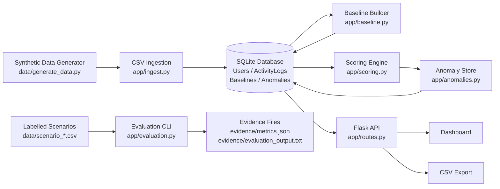
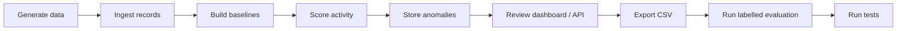

# Explainable Insider Threat Detection

[](https://www.python.org/)
[](https://flask.palletsprojects.com/)
[](https://www.sqlite.org/)
[](https://docs.pytest.org/)
[](.github/workflows/ci.yml)
[](data/generate_data.py)
[](app/scoring.py)

Explainable behaviour-based insider-threat detection using per-user statistical baseline
modelling and reproducible synthetic activity data.

---

## What this is / what this is not

**What this is.** An academic software artefact (COM668 Computing Project, AT3) that detects
anomalous insider behaviour from structured activity data. It demonstrates transparent anomaly
detection, reproducible evaluation, and evidence-backed software-engineering practice.

**What this is not.** This is **not** a SIEM, EDR, production monitoring system, employee
surveillance platform, or real-time insider-threat product. It runs on **synthetic data only**
and makes no claim of production readiness.

By design there is **no** machine learning, authentication, role management, real-time
monitoring, or cloud deployment - consistent with the AT2 scope and exclusions. See
[Limitations and scope](#limitations-and-scope).

## Problem

Insider threats are hard to detect because the actor is already trusted. A legitimate user can
cause harm while staying entirely within their authorised access, so perimeter controls,
allow/deny rules, and "blocked action" alerts rarely fire. The harmful signal is not a
prohibited operation - it is a *deviation* from how that specific person normally behaves.

This project focuses on that deviation. It models each user's normal activity, scores new
activity for statistically significant departure from that norm, and explains why a record was
flagged - rather than asking whether the action was permitted.

## What the system does

| Capability | Description |
|---|---|
| Deterministic synthetic data | Reproducible activity history and labelled scenarios from a fixed seed (`data/generate_data.py`); no real or personal data. |
| Validated CSV ingestion | Explicit per-row validation with rejection reporting, written through parameterised SQL (`app/ingest.py`). |
| Relational store | SQLite schema with four tables - `Users`, `ActivityLogs`, `Baselines`, `Anomalies` (`data/schema.sql`, `app/db.py`). |
| Per-user baselines | Mean / standard deviation of login hour and access count, plus the resource-type distribution, for every user meeting a minimum-records threshold (`app/baseline.py`). |
| Deviation scoring | Absolute Z-score for numeric features and a calibrated rarity score for the categorical resource type (`app/scoring.py`). |
| Configurable severity | Low / Medium / High bands from thresholds defined in one place (`app/config.py`, `app/anomalies.py`). |
| Explainable anomalies | Each stored anomaly records the responsible feature and a human-readable reason (`Anomalies.anomaly_reason`). |
| Dashboard | Summary tiles, filtering by user / date / severity, and a row-click detail panel (`app/routes.py`, `app/templates/`). |
| CSV export (FR10) | The filtered anomaly view can be downloaded as CSV. |
| Labelled evaluation | Per-scenario and combined precision / recall / F1 / false-positive rate plus threshold sensitivity, reproducible from one command (`app/evaluation.py`). |
| Tests and CI | A `pytest` suite and a GitHub Actions workflow that rebuilds the database, runs the tests, and runs the evaluation. |
| Evidence | Screenshots and generated metric/output files for assessment (`screenshots/`, `evidence/`). |

## System architecture



## End-to-end workflow



`scripts/rebuild.py` automates the first five steps as one deterministic command (generate ->
ingest -> baseline -> score). Ingestion is intentionally *not* idempotent, so the script resets
the database first to guarantee a clean rebuild.

## Detection and explainability model

Detection is per user. The system first learns a baseline of normal behaviour, then scores each
new activity record against that baseline.

- **Per-user baseline.** For each user the model stores the mean and standard deviation of login
  hour and access count, plus the distribution of resource types they touch.
- **Minimum history threshold.** A baseline is only built for users with at least `MIN_RECORDS`
  (20) historical records, so scoring is never based on too little data.
- **Login-time and access-count Z-scores.** Continuous features are scored with the absolute
  Z-score `|(value - mean) / sd|`, measuring how far a record sits from that user's norm.
- **Resource-type rarity.** The categorical resource type is scored with a calibrated rarity
  measure on roughly the same scale as a Z-score, so a common resource scores ~0 and an unseen
  one scores highly.
- **Severity bands.** The strongest single deviation is mapped to a severity band from one
  configurable place (`app/config.py`): Low at `Z >= 2.5`, Medium at `Z >= 3.0`, High at
  `Z >= 4.0`. Records below 2.5 are not flagged.
- **Strongest responsible feature.** Each anomaly stores the single feature most responsible for
  the flag and a short reason (e.g. *"Abnormal login_time, Z = 4.31"*), so every alert is
  explainable.

**Honesty note.** A statistical anomaly indicates unusual behaviour, *not* proven malicious
intent. Flags are decision support for a human analyst, not a verdict.

## Dashboard

The dashboard (`GET /`) presents the stored anomalies for analyst review:

- **Summary tiles** - activity logs, total anomalies, high-risk count, and users monitored.
- **Filters** - narrow the anomaly table by user, date range, and severity.
- **Anomaly table** - the flagged records matching the current filters.
- **Row detail** - clicking a row reveals the responsible feature and human-readable reason.
- **CSV download** - export the currently filtered anomalies (FR10).

Screenshots of each view are in [`screenshots/`](screenshots/).

## Quick start

Windows PowerShell, from the project root:

```powershell
python -m venv .venv
.\.venv\Scripts\Activate.ps1
pip install -r requirements.txt
python scripts/rebuild.py     # deterministic database rebuild (resets first)
python run.py
```

Then open the dashboard at `http://127.0.0.1:5000/`.

> The development server binds to port 5000. If that port is already in use, change the `port`
> argument in `run.py` (for example to 5001) and restart.

On the bundled synthetic data, `scripts/rebuild.py` produces **12,092 rows ingested, 20
baselines, and 299 anomalies (256 Low / 41 Medium / 2 High)**.

## Demo workflow for assessors

A complete AT3 walkthrough from a clean checkout:

```powershell
# 1. Environment
python -m venv .venv
.\.venv\Scripts\Activate.ps1
pip install -r requirements.txt

# 2. Build the deterministic demo database and start the app
python scripts/rebuild.py
python run.py
```

Then, in a browser at `http://127.0.0.1:5000/`:

1. Review the summary tiles (activity logs, anomalies, high-risk count, users monitored).
2. Set **Severity = High** and apply the filter to narrow the anomaly table.
3. Click an anomaly row to open the detail panel and read the **responsible feature** and
   **reason**.
4. Click **Download CSV** to export the currently filtered anomalies (FR10).
5. Open `http://127.0.0.1:5000/api/summary` to see the totals as JSON.
6. Open `http://127.0.0.1:5000/api/anomalies?severity=High` to see the filtered anomalies as JSON.

In a second terminal (with the virtual environment activated):

```powershell
python -m app.evaluation   # labelled scenario metrics (also writes evidence files)
pytest -q                  # automated test suite
```

A step-by-step script and checklist are in [`docs/at3-demo-script.md`](docs/at3-demo-script.md)
and [`docs/at3-demo-checklist.md`](docs/at3-demo-checklist.md).

## API summary

| Method | Route | Purpose |
|---|---|---|
| `GET` | `/` | Dashboard UI - summary tiles, filter panel, anomaly table, row-click detail. |
| `GET` | `/health` | Liveness check; returns `{"status": "ok"}`. |
| `GET` | `/api/summary` | Totals: activity logs, anomalies, high-risk anomalies, users monitored. |
| `GET` | `/api/anomalies` | Flagged anomalies as JSON; optional filters `user`, `start`, `end`, `severity` (e.g. `/api/anomalies?severity=High&start=2025-05-01`). |
| `GET` | `/api/anomalies.csv` | The same filtered anomalies as a downloadable CSV (FR10). |

All filters are applied through parameterised SQL.

## Evaluation evidence

The labelled evaluation is reproducible from one command:

```powershell
python -m app.evaluation
```

It prints per-scenario confusion matrices, combined metrics, and threshold sensitivity, and
writes `evidence/metrics.json` (machine-readable) and `evidence/evaluation_output.txt` (the
printed report). The discussion in [`docs/evaluation-report.md`](docs/evaluation-report.md) is
derived from this generated output, so the headline numbers are reproducible rather than
hand-transcribed.

On the bundled labelled synthetic scenarios (210 records, 56 labelled anomalies) at the default
threshold (2.5):

| Metric | Value |
|---|---|
| Precision | 0.9444 |
| Recall | 0.9107 |
| F1 | 0.9273 |
| False-positive rate | 0.0195 |
| Records evaluated | 210 |
| Labelled anomalies | 56 |
| Predicted anomalies | 54 (51 TP / 3 FP / 5 FN) |

These figures describe the bundled synthetic scenarios only. See
[`docs/evaluation-report.md`](docs/evaluation-report.md) for per-scenario results, threshold
trade-offs, and an honest discussion of where detection is weaker (notably the exfiltration
scenario, where weak combined signals can be missed).

> The rebuild counts above (12,092 / 20 / 299) come from the full synthetic activity history;
> these evaluation metrics come from the separate labelled scenario files. The two datasets are
> distinct and are not directly comparable.

## Testing and CI

The `pytest` suite (**115 passing**) covers:

- ingestion validation and rejection handling (`tests/test_ingest.py`);
- database operations and schema (`tests/test_db.py`);
- per-user baseline generation (`tests/test_baseline.py`);
- scoring logic and boundaries (`tests/test_scoring.py`);
- anomaly flagging and severity bands (`tests/test_anomalies.py`);
- API routes and the dashboard (`tests/test_routes.py`, `tests/test_dashboard.py`,
  `tests/test_app_factory.py`);
- CSV export and evaluation output (`tests/test_routes.py`, `tests/test_evaluation.py`,
  `tests/test_evaluation_cli.py`);
- deterministic data generation (`tests/test_data_generation.py`).

```powershell
pytest -q
```

GitHub Actions ([`.github/workflows/ci.yml`](.github/workflows/ci.yml)) runs on pushes and pull
requests using Python 3.11. The workflow installs `requirements.txt`, rebuilds the deterministic
demo database with `python scripts/rebuild.py`, runs `pytest -q`, and runs the labelled
evaluation with `python -m app.evaluation`.

## Project structure

```text
app/          Flask app factory, config, ingestion, baselines, scoring, anomalies, API routes, evaluation
data/         schema.sql, synthetic data generator, data dictionary, generated CSVs
scripts/      rebuild.py - one-command deterministic database rebuild
tests/        pytest suite
docs/         evaluation report, demo script/checklist, code-walkthrough map, evidence index
screenshots/  demonstration captures
evidence/     generated metrics, exports, and terminal output
instance/     SQLite database (generated at runtime; not committed)
run.py        development server entry point
```

## Requirements / AT2 traceability

This artefact implements the design committed in the AT2 Challenge Definition Report.

| AT2 requirement | Implemented by | Evidence |
|---|---|---|
| FR1 ingestion | `app/ingest.py`, `data/schema.sql` (`ActivityLogs`) | `tests/test_ingest.py`; rebuild summary |
| FR2 relational store | `data/schema.sql` (four tables), `app/db.py` | `tests/test_db.py` |
| FR3 per-user baselines (>= 20 records) | `app/baseline.py`; `MIN_RECORDS` in `app/config.py` | `tests/test_baseline.py` |
| FR4 Z-score scoring | `app/scoring.py` | `tests/test_scoring.py` |
| FR5 / FR6 flagging + severity bands | `app/anomalies.py`; thresholds in `app/config.py` | `tests/test_anomalies.py` |
| FR7 / FR8 dashboard + filtering | `app/routes.py`, `app/templates/`, `app/static/` | `tests/test_routes.py`, `screenshots/01-03` |
| FR9 / Objective 4 scenario evaluation | `app/evaluation.py` | `evidence/metrics.json`, `docs/evaluation-report.md` |
| FR10 CSV export | `GET /api/anomalies.csv`, dashboard **Download CSV** button | `evidence/anomalies_export.csv`, `screenshots/04` |
| NFR1 explainable reason | `Anomalies.anomaly_reason`, dashboard detail panel | `screenshots/03` |
| NFR2 synthetic data only | `data/generate_data.py` | `data/data-dictionary.md` |

A fuller requirement-to-code and requirement-to-test mapping is in
[`docs/code-walkthrough-map.md`](docs/code-walkthrough-map.md).

## Limitations and scope

This is an academic artefact, not a production or deployed security system.

- **Synthetic data only.** All activity is generated; labels come from the scenario generator,
  not from analyst-confirmed incidents.
- **Not production-ready.** No deployment hardening, packaging, or operational support.
- **No live monitoring.** The system scores a static, ingested dataset, not a real-time feed.
- **No authentication or RBAC.** The dashboard and API are open and read-only.
- **Transparent statistics, not machine learning.** A deliberate choice that keeps every
  decision explainable.
- **No cloud deployment.** It runs locally via the Flask development server.
- **Anomaly != malicious intent.** Flags indicate unusual behaviour and require human judgement.
- **Single strongest-signal scoring.** An anomaly is flagged on its strongest individual feature
  deviation, so behaviour that appears only as several weak signals can be missed.
- **Results depend on the generated scenarios.** The reported metrics describe the bundled
  synthetic scenarios and do not generalise to real environments.

## Further documentation

- [`docs/evaluation-report.md`](docs/evaluation-report.md) - per-scenario results and discussion.
- [`docs/code-walkthrough-map.md`](docs/code-walkthrough-map.md) - requirement-to-code and
  requirement-to-test mapping.
- [`docs/at3-demo-script.md`](docs/at3-demo-script.md) - step-by-step demo script.
- [`docs/at3-demo-checklist.md`](docs/at3-demo-checklist.md) - demo checklist.
- [`screenshots/`](screenshots/) - demonstration captures.
- [`evidence/`](evidence/) - generated metrics, exports, and terminal output.

## Roadmap / future work

Not implemented; recorded as possible future directions:

- role-aware dashboard views;
- combined multi-signal scoring (instead of strongest single feature);
- a richer threshold-tuning UI;
- migration from SQLite to PostgreSQL;
- optional authentication for a deployed demo;
- comparison against a larger benchmark dataset;
- an analyst feedback loop to refine flags over time.

## Academic integrity

All data is synthetic; no real or personal data is processed (AT2 NFR2).
