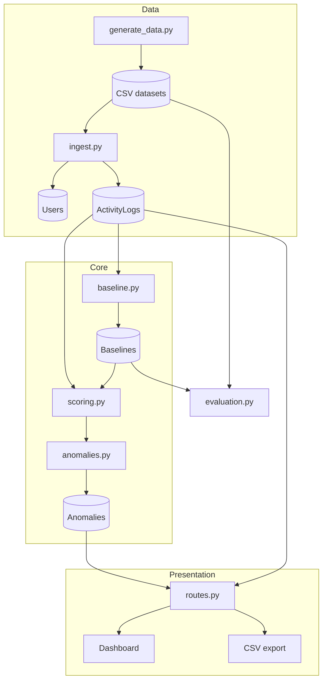
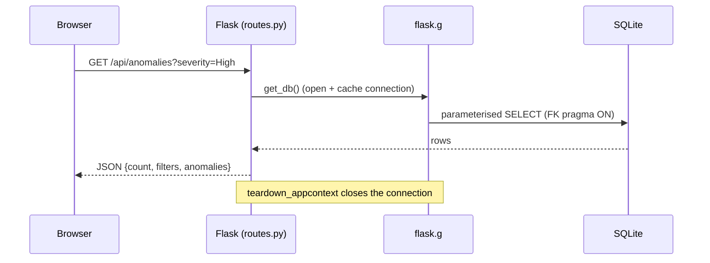

# Architecture

This document describes how the modules fit together, how data moves through the
system, and the request lifecycle of the web layer. It is reference material; the
high-level summary lives in the [README](../README.md).

## Design principles

1. **One-way data flow.** Raw activity becomes baselines, baselines plus activity
   become scores, scores become stored anomalies, and anomalies are served read-only.
   No stage writes back into an earlier one.
2. **A pure detection core.** `app/scoring.py` performs no I/O at all -- it takes a
   record and a baseline and returns numbers. This makes the statistical heart of the
   system trivially unit-testable and free of database coupling.
3. **Narrow data-access layer.** All SQLite access is funnelled through `app/db.py`,
   which is the only module that opens connections and enforces per-connection
   pragmas.
4. **Configuration in one place.** Thresholds and limits live in `app/config.py` so
   detection behaviour is tunable without editing logic (AT2 FR5).

## Module map

| Module | Layer | I/O | Responsibility |
|---|---|---|---|
| `data/generate_data.py` | Data | Writes CSV | Deterministic synthetic data (seed 42) |
| `app/ingest.py` | Data | Reads CSV, writes DB | Validate rows; insert users and activity |
| `app/db.py` | Data | DB connections | Connect, init schema, Flask request scoping |
| `app/baseline.py` | Core | Reads/writes DB | Per-user mean/SD and resource distribution |
| `app/scoring.py` | Core | **None** | Z-score, rarity, responsible feature, reason |
| `app/anomalies.py` | Core | Reads/writes DB | Severity classification and anomaly storage |
| `app/evaluation.py` | Eval | Reads CSV + DB | Score labelled scenarios; report metrics |
| `app/routes.py` | Presentation | Reads DB | Dashboard shell and JSON/CSV endpoints |
| `app/__init__.py` | Presentation | -- | Flask application factory; `/health` |
| `scripts/rebuild.py` | Orchestration | Drives all | One-command end-to-end rebuild |
| `run.py` | Orchestration | -- | Development server entry point |

## Data flow

### Stage detail

1. **Generate.** `generate_data.py` threads a single seeded `numpy.random.Generator`
   through every step, producing `activity_baseline.csv` plus three labelled scenario
   CSVs. Output is byte-identical on every run.
2. **Ingest.** `ingest.py` reads everything as strings, validates each row, inserts
   distinct users (`INSERT OR IGNORE`) and then activity rows, all inside one
   transaction with rollback on failure. The `label` column is validated but not
   stored (the schema has no label column; labels are only used in evaluation).
3. **Baseline.** `baseline.py` computes, for each user with at least `MIN_RECORDS`
   rows, the mean and population SD of login hour and access count, the modal resource
   type, and a sorted resource-distribution JSON. Users below the threshold are
   excluded and logged.
4. **Score.** `scoring.py` converts each record into three comparable deviation scores
   and selects the strongest as the responsible feature. It is pure.
5. **Classify and store.** `anomalies.py` maps the maximum deviation score to a
   severity band and persists flagged records (with the responsible reason) via
   parameterised `executemany`, clearing prior anomalies first for repeatable demos.
6. **Serve.** `routes.py` exposes summary counts and a filtered, parameterised anomaly
   query shared by the JSON and CSV endpoints.

## Request lifecycle (web layer)

`get_db()` caches one connection per request on `flask.g`; `close_db` (registered by
`init_app`) closes it at the end of the request. Every connection enables
`PRAGMA foreign_keys = ON` because SQLite disables foreign keys by default and the
setting is per-connection.

## Why the core is pure

Keeping `scoring.py` free of database access means the math can be tested directly
(see `tests/test_scoring.py`) with hand-constructed baselines, including the awkward
cases: zero standard deviation, unseen resource types, tie-breaking between equal
feature scores, and non-finite guards. The database-touching modules
(`baseline.py`, `anomalies.py`) are then tested separately against a temporary
database, so a failure points clearly at either the math or the persistence.

## Related documents

- [DETECTION_ENGINE.md](DETECTION_ENGINE.md) -- the scoring formulae in detail.
- [MODEL_ASSUMPTIONS.md](MODEL_ASSUMPTIONS.md) -- trust boundaries and assumptions.
- [API_ENDPOINTS.md](API_ENDPOINTS.md) -- full route specifications.
