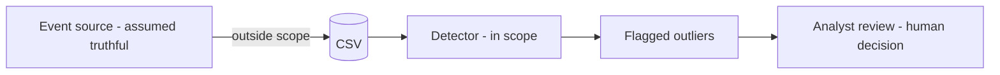

# Model Assumptions & Trust Boundaries

This is the artefact's threat-model analogue. It states precisely what the detector
assumes, what a flag means, and -- just as importantly -- what it does **not** mean, so
results are never over-claimed in the report or the demo.

## One-sentence trust statement

> The detector flags a record when that user's behaviour deviates from **their own
> historical baseline** by at least the configured threshold. A flag indicates a
> **statistical outlier**, not confirmed malicious intent.

## Assumptions

| # | Assumption | Consequence if violated |
|---|---|---|
| A1 | A user's past activity is broadly representative of their "normal" | A user whose role changes legitimately will generate false positives until re-baselined |
| A2 | At least 20 records exist per user before baselining | Cold-start users are excluded from detection entirely |
| A3 | Each feature is meaningful on its own | Threats visible only as combined weak signals are missed (single strongest-feature scoring) |
| A4 | Login hour behaves linearly | Activity either side of midnight can appear more deviant than it is |
| A5 | The ingested data is the ground truth of what happened | The detector cannot tell whether the source events were themselves truthful |
| A6 | Synthetic labels approximate real anomaly/normal classes | Real-world effectiveness is not established by these metrics |

## What a flag does and does not mean

| A flag **means** | A flag does **not** mean |
|---|---|
| This record is statistically unusual for this user | The user is malicious |
| The responsible feature deviated past threshold | The activity broke a policy |
| The deviation is explainable and reproducible | A human has confirmed an incident |

Conversely, the **absence** of a flag does not certify safe behaviour: an insider who
stays within their own statistical envelope, or who spreads activity thinly across
several features, will not be flagged.

## Trust boundaries

- **Upstream of the CSV (out of scope):** the system trusts that ingested records
  faithfully describe real events. It verifies *deviation*, not *provenance*.
- **The detector (in scope):** validation, baselining, scoring, classification, and
  explanation are all in scope and tested.
- **Downstream of a flag (out of scope):** triage and the malicious/benign decision are
  left to a human analyst. The artefact deliberately stops at "here is an explained
  outlier."

## Known limitations that follow from the model

- **Single strongest-signal scoring.** The record's score is the maximum of its three
  feature scores, so combined weak signals can fall below threshold. This is the direct
  cause of the missed exfiltration cases in the evaluation.
- **Same-data baselines for the dashboard.** Stored dashboard anomalies are outliers
  found within the same history used to build the baselines. The **labelled scenarios**
  provide the stronger held-out evidence and are the basis for the published metrics.
- **Population SD.** Baselines use `ddof=0`; they describe the observed history rather
  than inferring a wider population.
- **Application-enforced invariants.** Severity values and one-baseline/anomaly-per
  expectations are maintained by application logic, not by database constraints.

## Out of scope (per AT2)

Authentication, role management, real-time monitoring, machine learning, cross-user
correlation, pagination/charts, and cloud deployment are explicitly excluded. These are
not gaps in the implementation -- they are boundaries of the assessment scope, recorded
in the README roadmap as future work.

## Related documents

- [DETECTION_ENGINE.md](DETECTION_ENGINE.md) -- the scoring that produces a flag.
- [evaluation-report.md](evaluation-report.md) -- where the model's limits show up in
  the numbers.
